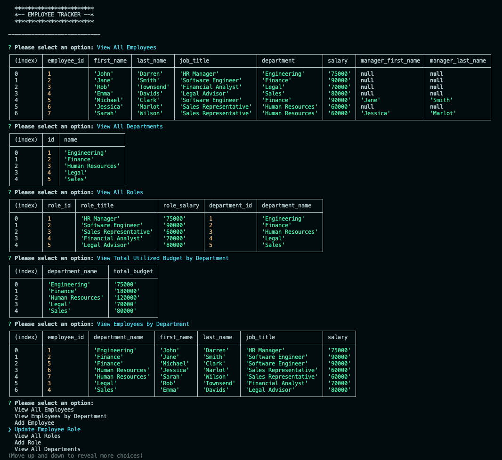

# C12-SQL-Employee-Tracker

## Project Description

A command-line application designed to manage a company's employee database. Its interface allows you to view and manage information about employees, roles, and departments, leveraging SQL for data storage and retrieval. This project is built using Node.js, Express, Inquirer, and PostgreSQL.

## Features

- **View All Employees**: Displays a table of all employees, including their IDs, names, job titles, departments, salaries, and managers.
- **View Employees by Department**: Lists employees grouped by their respective departments.
- **Add Employee**: Prompts for employee details and adds a new employee to the database.
- **Update Employee Role**: Allows updating an employee's role based on their ID.
- **View All Roles**: Lists all job roles, including role ID, title, salary, and department information.
- **Add Role**: Prompts for role details and adds a new role to the database.
- **View All Departments**: Lists all departments, showing department ID and name.
- **Add Department**: Prompts for department name and adds a new department to the database.
- **View Total Utilized Budget by Department**: Calculates and displays the current salary budget being used by department.
- **Exit**: Exits the application.

## Usage

1. **Install Dependencies**: Ensure you have Node.js and PostgreSQL installed. Run `npm install` to install required packages.

2. **Set Up Database**:

   - Create a PostgreSQL database named `org_db` (rename if needed).
   - Use the provided SQL schema to set up tables for `employee`, `role`, and `department`.

3. **Run the Application**: Execute `npm start` in your terminal to start the application. Use the arrow keys to navigate the menu and select options.

4. **Perform Actions**: Follow the on-screen prompts to view, add, or update employees, roles, and departments.

## Example(s)

[Demo Video](https://drive.google.com/file/d/1xElCkefVpux2sOjWfLmoYHJaoP3Z2y20/view)

## Source Code

- Created by [Lixiviate](https://github.com/Lixiviate)
- Code Assistance:
  - [MDN Web Docs](https://developer.mozilla.org/en-US/)
  - [W3Schools](https://www.w3schools.com/)
  - [edX Xpert Learning Assistant](https://www.edx.org/)
- Development Resources:
  - [dotenv](https://www.npmjs.com/package/dotenv)
  - [Express.js](https://www.npmjs.com/package/express)
  - [Inquirer.js](https://www.npmjs.com/package/inquirer/v/8.2.4)
  - [node-postgres](https://www.npmjs.com/package/pg)
  - [PostgreSQL](https://www.postgresql.org/)

## License

This project is licensed under the MIT license.
